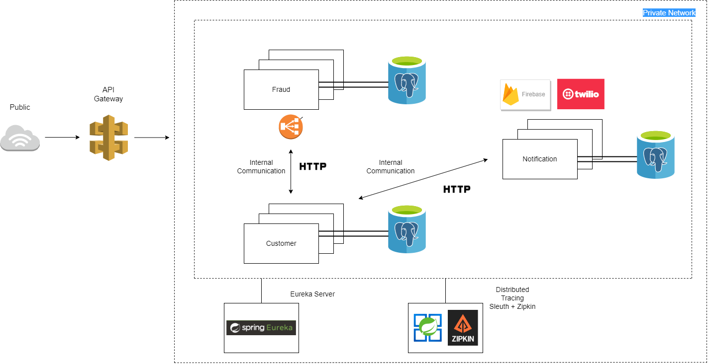

### High-level Overview

### Microservices
* **Customer:** The goal of this microservice is to handle all Customer registration requests.
* **Fraud:** The goal of this microservice is to handle and perform all fraud checks i.e. if a customer is fraudulent or not.
* **Notification:** The goal of this microservice is to send an async notification to user's smartphone or any other device when the user has registered successfully via third-party providers like Firebase or Twilio.

### API Gateway
`api-gateway` microservice uses `spring-cloud-starter-gateway` dependency to mark this service as API Gateway microservice. `APIGatewayApplication` class is annotated with `@EnableDiscoveryClient` to tell Spring that it will use Eureka Service Discovery to get complete URIs of running instances. The `application.yml` file contains Routes of other microservices.

### Service Discovery
`eureka-server` uses `spring-cloud-starter-netflix-eureka-server` to register instance as server while other microservices `customer`, `fraud` uses `spring-cloud-starter-netflix-eureka-client` to register themselves as clients.

#### Load Balancing
The `customer` microservice uses round-robin DNS load balancing algorithm to perform routing to x instance of `fraud` microservice. `CustomerConfig` class contains `restTemplate()` method which is annotated with `@LoadBalanced` to perform load balancing.

#### Eureka Server connection pool

### Distributed Tracing
#### Zipkin & Sleuth

&nbsp; 

Uses `spring-cloud-starter-sleuth` and `spring-cloud-sleuth-zipkin` across all microservices. Zipkin server runs via a Java jar on same machine. Zipkin can also be configured inside `docker-compose.yml` to run in Docker container. The default port of Zipkin server is `9411`.

